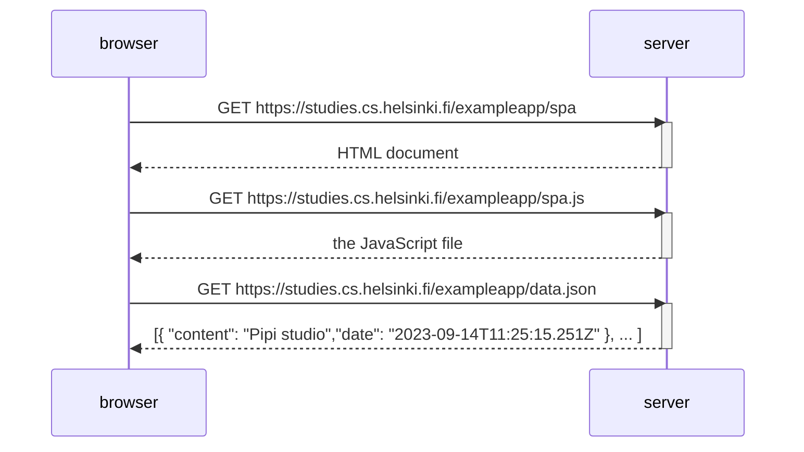

```mermaid
sequenceDiagram
    participant browser
    participant server
browser->>server: GET https://studies.cs.helsinki.fi/exampleapp/spa
 activate server
    server-->>browser: HTML document
deactivate server

browser->>server: GET https://studies.cs.helsinki.fi/exampleapp/spa.js
  activate server
    server-->>browser: the JavaScript file
    deactivate server

browser->>server: GET https://studies.cs.helsinki.fi/exampleapp/data.json
 activate server
    server-->>browser: [{ "content": "Pipi studio","date": "2023-09-14T11:25:15.251Z" }, ... ]
    deactivate server

```
